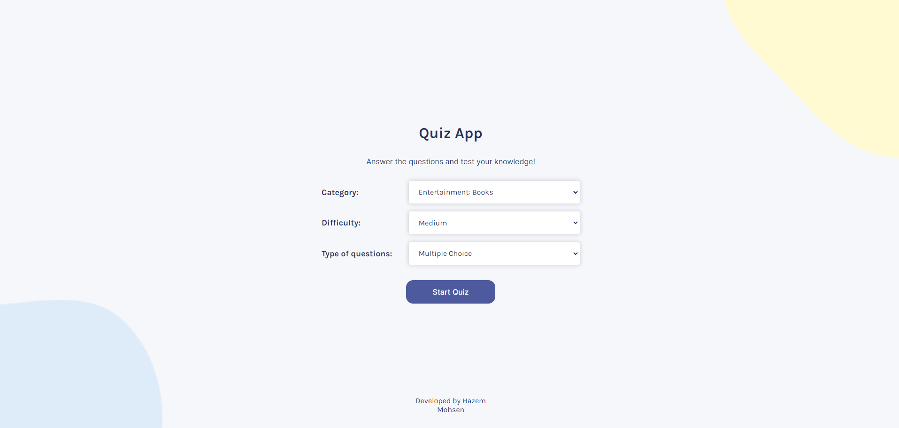
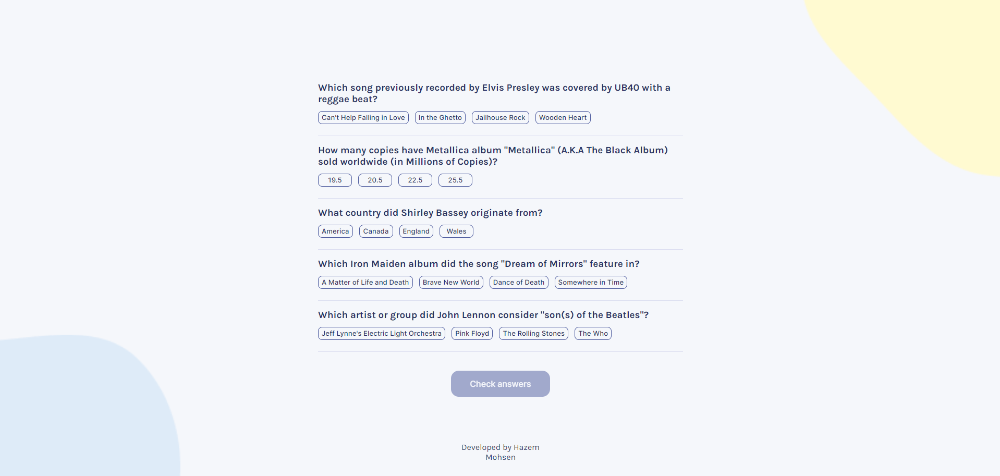
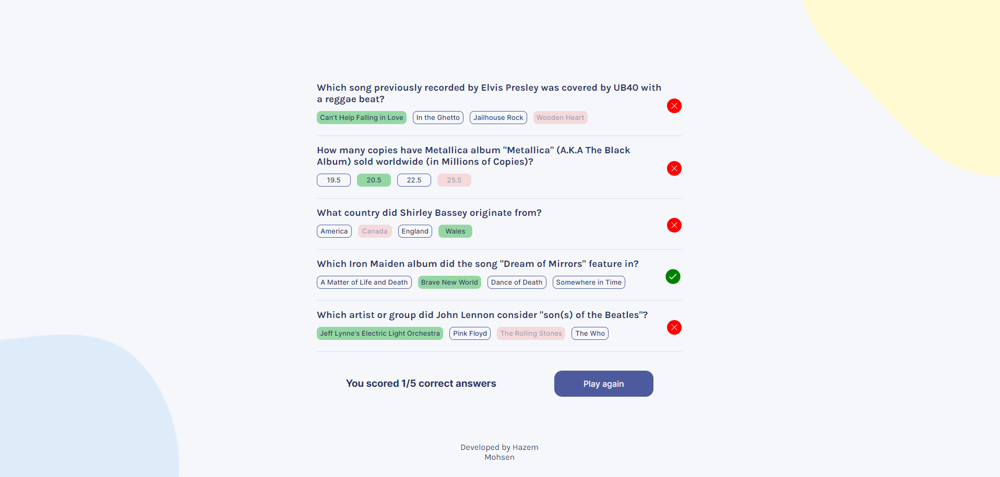

# QuizziC
- This repository contains a React app for a quiz game where users can test their knowledge on various topics.

# Features
- Category Selection: Users can choose from a variety of categories for their quiz, ranging from general knowledge to specific topics.
- Difficulty Levels: Choose between easy, medium, or hard difficulty levels to customize the quiz experience.
- Question Types: Select either true/false questions or multiple-choice questions for each quiz.
- Quiz Length: The quiz consists of 5 questions, providing a quick and # engaging experience.
- Answer Checking: After completing the quiz, users can check their answers and see how they performed.
# How to Use
- Select Quiz Options:
Choose a category, difficulty level, and question type before starting the quiz.
- Take the Quiz:
Answer 5 questions to the best of your ability.
- Check Answers:
After completing the quiz, review your answers to see how you did.
# Technologies Used
- React for frontend development.
- Open Trivia Database API for fetching quiz questions.
# Setup Instructions
- Clone the repository: git clone https://github.com/your-username/quiz-game-react.git
- Navigate to the project directory: cd quiz-game-react
- Install dependencies: npm install
- Start the development server: npm start
- Open your browser and visit: http://localhost:3000
# Demo
[Link to Live Demo](https://quizzic.netlify.app/)

# Screenshots
.

